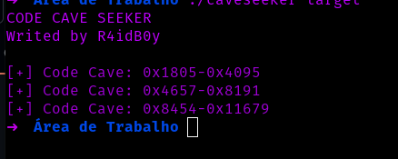

# codecaverseeker
Code Caver Seeker in C

# O que é um Code Cave?

Um "code cave" é um espaço vazio dentro de um programa onde você pode adicionar código extra. É como encontrar um espaço livre em uma casa onde você pode construir um novo cômodo.

# O que é um Code Cave Seeker?

Um "code caver seeker" é uma ferramenta usada para encontrar esses espaços vazios (code caves) dentro de um programa. Ela ajuda a localizar áreas onde você pode injetar código adicional sem causar problemas no funcionamento do programa.

# B0a sorte!

